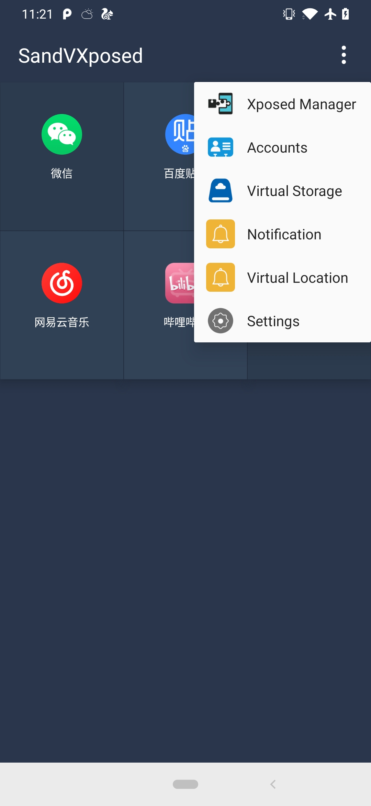
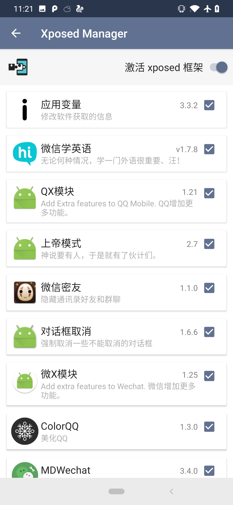

# SandVXposed
VirtualApp with SandHook
Can load xposed modules without root!

# How to use

install target app and xposed modules in SandVXposed

# support

5.0 - 10.0

7.0 - 9.0 tested

10.0 not stable

# Plugin tested

Q++
QX
WX
上帝模式
MDWechat
XPrivacyLua
微信学英语
应用变量
。。。

# ScreenShot

# SandHook
https://github.com/ganyao114/SandHook

# VirtualApp
https://github.com/asLody/VirtualApp

# Chinese

[VirtualApp 源码分析](https://blog.csdn.net/ganyao939543405/article/details/76146760)

# License

注意！此项目由于使用了 VirtualApp 开源版，License 与 VirtualApp 相同，切勿用作商业用途，否则自负法律风险。  
如需取得授权并使用更加稳定的商业版源码，请联系微信：10890
